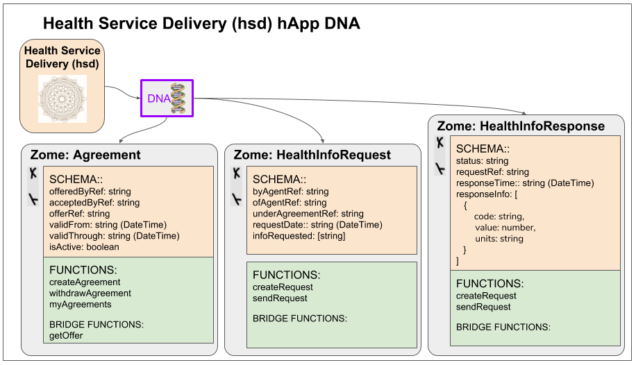
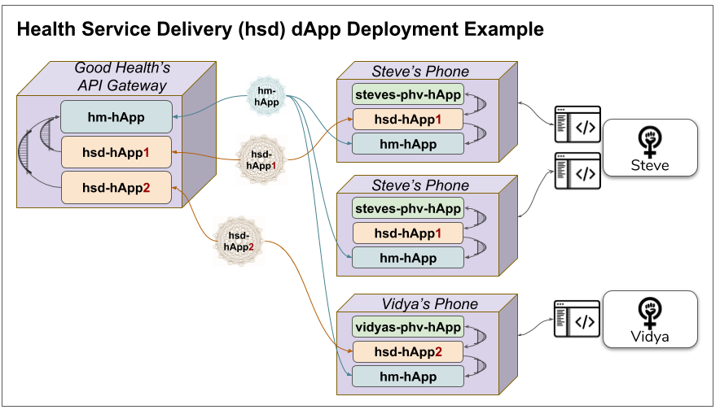

# Health Service Delivery hApp
The _Health Service Delivery hApp_ is one of a set of hApp's designed to work together to support the emergence of _**person-centric healthcare ecosystems**_ on top of a _holochain_ based infrastructure. Refer to the [holo-health project README](../README.md) for an overview of the project including its goals and guiding principles. Refer to [Holo-Health App Architecture](../holo-health-app-architecture.md) for an architectural overview.

# Overview
An instance of this _hsd_ hApp is created when a person _accepts_ a _Healthcare Service offer_ placed in the _Healthcare Market_ by a _Healthcare Provider_. The _hsd_ serves as a private channel between the two parties. Both the _agreement_ (which includes a reference to the _offer_ on which the _agreement_ was based) and the _requests_ and _responses_ made by either party, are recorded in the DHT for this hApp instance. This provides a secure, non-forgeable, immutable, non-repudiable audit trail that is necessary for both invoicing and regulatory compliance. 

The _Healthcare Service Delivery hApp_ is intended to support a very broad range of services (including both electronic and in-person) offered under a broad range of _agreement types_. The hApp will automatically check all _requests_ by a _Healthcare Provider_  to ensure they comply with the terms specified in the _agreement_. If not, the request is  rejected (and both the _request_ and the _rejection_ recorded in the _hsd's_ DHT). If the _request_ conforms to the _agreement_, the _hsd_ bridges to the _Personal Health Vault (phv)_ hApp to retrieve requested personal health information from the person's vault and also to record observations made by the _Healthcare Provider_ back into the persons's vault.

# Proof of Concept (PoC) Simplistic Implementation 
The goal for the initial Proof-of-Concept (PoC) is to demonstrate the basic application architecture and hApp collaboration model. As such, a very simplistic concept of healthcare service delivery will be implemented in the PoC. 

## DNA

## Proof of Concept (PoC) Deployment Architecture Example

# Future Enhancements
